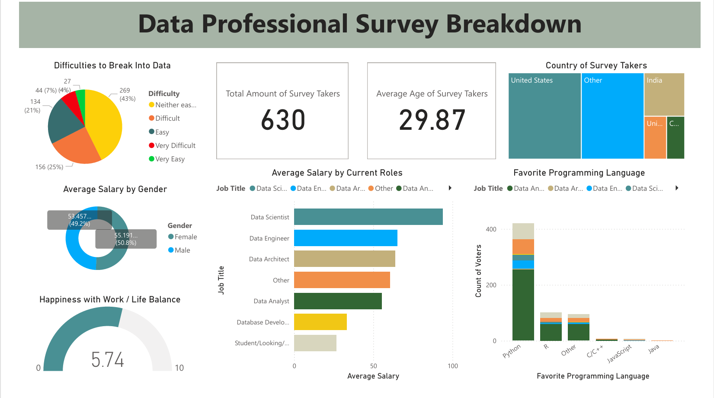

# 📊 Power BI Data Professional Survey Analysis

This project analyzes survey data from data professionals to uncover insights about career roles, salaries, skills, work-life balance, and challenges faced in the industry.  
The dashboard is built using **Power BI** and designed for clear, business-focused storytelling.

---

## 🚀 Project Objective

The goal of this project is to:
- Understand trends among data professionals
- Compare roles, salaries, and job satisfaction
- Identify key skills used in the industry
- Present insights in an interactive and easy-to-understand dashboard

---

## 📁 Repository Structure

powerbi-data-professional-survey/

├── data/

│ └── Data_Professional_Survey.xlsx

├── powerbi/

│ └── Data_Professional_Survey_Breakdown_Project.pbix

├── reports/

│ └── Survey_Insights_Report.pdf

├── visual/

│ └── Dashboard_Image.png

└── README.md

---

## 📊 Dashboard Overview

The Power BI dashboard answers key questions such as:
- What roles are most common among data professionals?
- How do salaries differ by role?
- Which tools and skills are most frequently used?
- How satisfied are professionals with their work-life balance?
- What challenges are commonly faced in the industry?

---

## 🖼 Dashboard Preview

---

## 💡 Key Insights

- Data Analysts and Data Scientists make up the majority of respondents
- Higher salaries are strongly associated with specialized roles
- Python are among the most used skills
- Many professionals report challenges with work-life balance
- Career satisfaction varies significantly by role and experience

---

## 🛠 Tools & Technologies

- Power BI
- Excel (data source)
- Data modeling & DAX
- Data visualization and storytelling

---

## 📌 How to View This Project

- 📄 **PDF Report**: Open the file in the `reports/` or `visual/`folder
- 📊 **Power BI File**: Download the `.pbix` file from the `powerbi/` folder and open it in Power BI Desktop

---

## 📬 Contact

Feel free to explore the repository and reach out if you’d like to discuss insights, dashboards, or future improvements.
